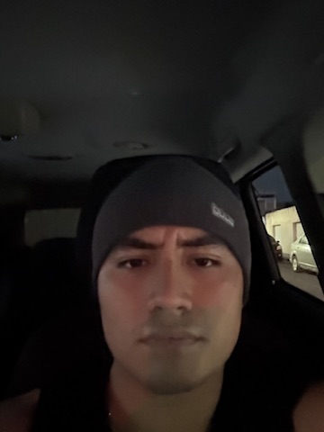

# Reflexión Personal

## Mis intereses y experiencias previas relacionadas con videojuegos o desarrollo

Desde niño me han gustado los juegos de mundo abierto y de aventura, y conforme fui creciendo me empezo a gustar el jugar con mis amigos, y en el desarrollo de videojuegos no tengo mucha experiencia, solo pequeños proyectos.

## ¿Qué significa para ti "diseñar un videojuego" en este momento?

Tener la creatividad y la habilidad de poder crear mundos, escenarios, personajes, etc. los cuales reflejen todo lo que haz estdo imaginando

## Cómo me imagino mi rol como diseñador durante el curso

Dirigir un poco el lado de la creacion de personajes y la historia del juego

## Foto

